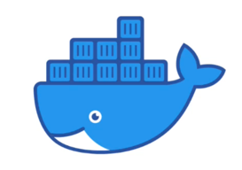
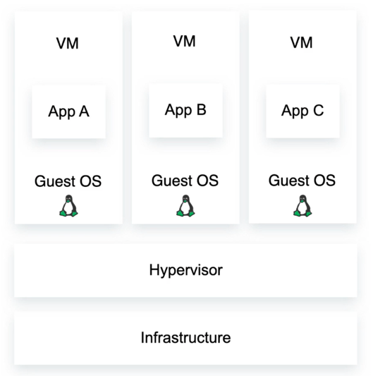
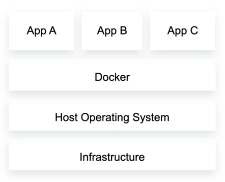
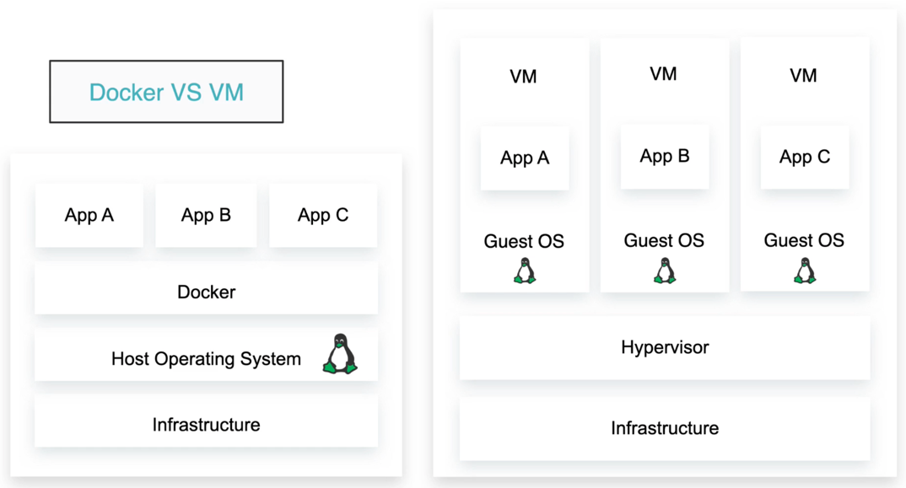
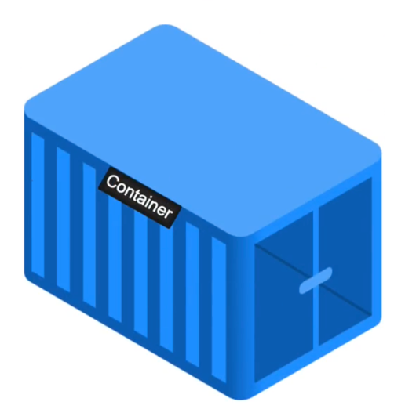
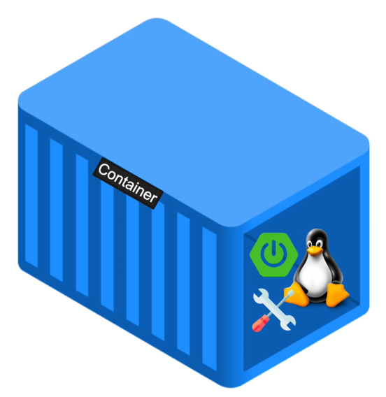
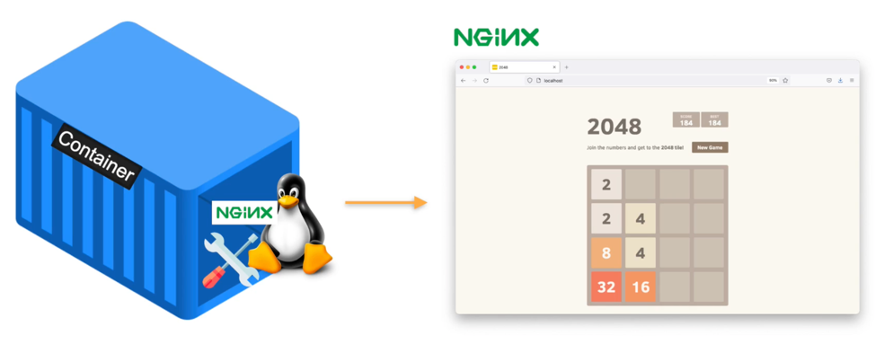
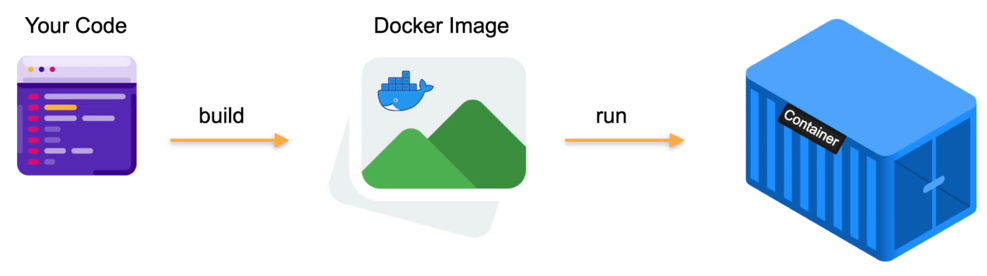
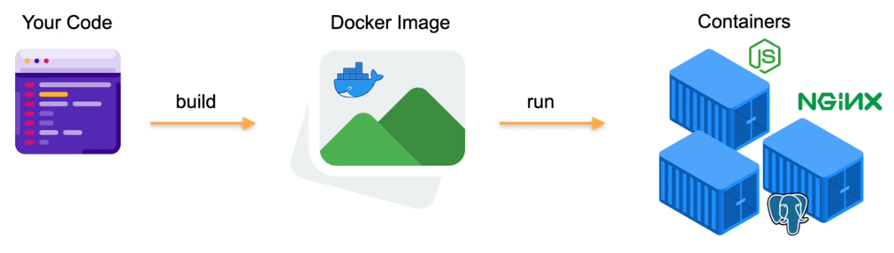
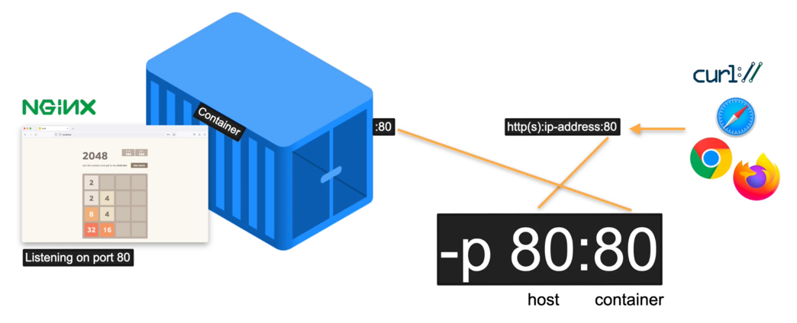

# 1. Getting Started

## 1.1. What Is Docker



- Platform for building, running and shipping applications.
- Developers can easily build and deploy applications running in **containers**.
- Container is like a running instance of our application, packaged up and running within a container.
- Local development is the same across any environment.
  - There are scenarios where the application may work on your local machine, but doesn't work on development, staging or production environment, because of hardware issues, installation problems etc.
  - Docker abstracts and solves all of those problems so that it always works on every environment and every machine.
- Docker is also used a lot for CI/CD (Continuous Integration/Continuous Delivery) workflows.

## 1.2. Docker vs VM

### 1.2.1. Virtual Machine (VM)

- **Virtual Machines (VMs)** are an abstraction of physical hardware turning one **server** into **many servers**.
- The **hypervisor** allows multiple VMs to run on a single machine.
- Each VM includes a **full copy** of an operating system, the application, necessary binaries and libraries – taking up tens of GBs.
- VMs can also be slow to boot, whereas with Docker containers are very fast to boot.



- Each VM consists of:
  - Infrastructure
  - Hypervisor
  - VM (application) running on a Linux OS (this can have multiple copies, each one running the application).

### 1.2.2. Docker

- Docker runs your applications in something called **containers**.
- **Containers** are an abstraction at the app layer that packages code and dependencies together.
- Multiple containers can run on the same machine and share the OS kernel with other containers, each running as isolated processes in user space.
- Containers take up less space than VMs (container images are typically tens of MBs in size), can handle more applications and require fewer VMs and operating systems.


- Each container consists of:
  - Infrastructure
  - Host operating system
  - Docker
  - Application (which can have multiple copies).

### 1.2.3. Docker vs VM



- The key difference is the host operating system.
- VM has 3 copies while Docker only has 1.
- Therefore, we gain more performance using Docker.

### 1.2.4. The Difference

| Docker                           | VM                         |
|----------------------------------|----------------------------|
| Portable                         | Requires more memory       |
| Requires less memory             | Each VM runs on its own OS |
| All containers share the same OS | Startup time in minutes    |
| Startup time in milliseconds     | More secure                |
| Process level isolation          | Less popular these days    |
| Very popular                     |                            |

## 1.3. Installing Docker

- Install docker on https://docker.com/ and follow installation instructions.

## 1.4. Exploring Docker Dashboard

- **Containers / Apps tab:**
  - This is where the applications we built will be running.
  - Initially there shouldn't be anything listed.
- **Images tab:**
  - These are the images either on your local machine or remote repositories (Docker registries).
- **Volumes tab:**
  - This is used, so you can share data between host and containers.
- **Dev Environments:**
  - Define your project's configuration as code, distribute your project easily amongst your team, and have everyone work on the same code and any dependencies with one click.

## 1.5. Tools

Useful tools and resources to know and install that will be helpful in using Docker:
- Knowledge of: terminal, bash & Vim
- https://gitforwindows.org/ (Windows)
- https://cmder.app/
- https://iterm2.com/ (Mac)

## 1.6. Getting Started With Docker

1. Verify that Docker is installed:
```bash
docker --version
```
- This command should output the installed Docker version.
2. View all available Docker commands:
```bash
docker
```
3. Create a Hello World Docker application:
```bash
docker run -d -p 80:80 docker/getting-started
```
4. Navigate to the browser and check if Docker is now running on localhost:
```bash
http://localhost
```
5. List all running Docker processes:
```bash
docker ps
```
- There should be a `docker/getting-started` image process running.
6. Stop the container from running by targeting container ID:
```bash
docker stop 9919e467353a
```
7. Remove the entire docker container:
```bash
docker rm 9919e467353a
```
8. Pull and run a specific Docker image:
```bash
docker run -d -p 80:80 milanobrenovic/2048
```
9. Now test if a 2048 game is running on localhost:
```bash
http://localhost
```

# 2. Containers

## 2.1. Understanding Containers

### 2.1.1. Containers



- Container is an **isolated** environment for running applications.



- Contains everything your application needs, such as:
  - Operating system
  - Tools and binaries
  - And most importantly, software (spring boot, nodejs, golang, javascript, or whatever is the backend application built on)



- When you run the command `docker run` following the image name, that gave us the application deployed on Docker.

1. The command `docker ps` gives us a list of all running containers:
```bash
docker ps
```
- There should be 0 containers running.
2. Assuming there are no running containers, let's run the `milanobrenovic/2048` image:
```bash
docker run -d -p 80:80 milanobrenovic/2048
```
3. Now when you list all the Docker processes running:
```bash
docker ps
```
- There should be 1 running.
- Basically the process running here is a **container**.
4. Execute into the running container via interactive mode using container ID:
```bash
docker exec -it 4edc54e943c5 sh
```
5. Within the shell, list all the files and folders:
```bash
ls
```
6. Navigate to `nginx` directory:
```bash
cd /usr/share/nginx/html
```
7. By using `ls` in this directory, you can see all the files and folders uploaded via Docker which is then being run on http://localhost.

## 2.2. Docker Images And Containers



- Usually when building software, you have your source code, which is any code written in any programming language.
- What you (as a developer) do, is you take that code, and then you build a Docker image.
- From this Docker image, you can run a container.
- Docker image is like a template for running the application.



- From 1 Docker image, you can run multiple containers.
- A Docker container can be a javascript app, nginx, postgres or any technology that you want to use.
- In the previous examples, `milanobrenovic/2048` is the **image name**.
- From this image name, we can run a container.

1. To run a different image but on a port `8080`, use command:
```bash
docker run -d -p 8080:80 nginx
```
- Here we have started an image `nginx` which runs a container serving us the nginx starter template.
2. List all Docker processes running:
```bash
docker ps
```
3. Check in the browser and verify that this container is running:
```bash
http://localhost:8080
```
4. To browse through all public Docker images, go to https://hub.docker.com/search?q=.
5. Let's try to install a WordPress Docker image:
```bash
docker run -d -p 8081:80 wordpress
```
- **Note:** this will be run on port `8081` because `80` and `8080` are already taken and running.
6. Check on localhost if WordPress Docker container is running:
```bash
http://localhost:8081
```

## 2.3. Managing Containers

1. List all running Docker containers:
```bash
docker ps
```
- By now it should be 3 containers: 2048, nginx and wordpress.
2. Stop the `wordpress` container by container ID:
```bash
docker stop 3635573b4e19
```
3. List ALL containers (including the ones that are not running):
```bash
docker ps -a
```
4. Remove the `wordpress` container completely by container ID:
```bash
docker rm 3635573b4e19
```
- In case the container is running, you would need to stop it first and then remove.
5. To remove a running container without stopping it first, use command:
```bash
docker rm -f 3635573b4e19
```

## 2.4. Docker Ps Format

1. To have a different format output than the one printed after using `docker ps` command, export this variable in the system environment variables:
```bash
export DOCKER_ROW_FORMAT="ID:\t\t{{.ID}}\nNAME:\t\t{{.Names}}\nIMAGE:\t\t{{.Image}}\nPORTS:\t\t{{.Ports}}\nCOMMAND:\t{{.Command}}\nCREATED:\t{{.CreatedAt}}\nSTATUS:\t\t{{.Status}}\n"
```
2. To apply this new format, use command:
```bash
docker ps --format=$DOCKER_ROW_FORMAT
```

## 2.5. Exposing Ports



- Currently, we have a container which is running a 2048 game, which is based off nginx image, and it's listening on port 80.
- Sometimes we may want to expose the application to users.
- It could be a React application, just a web browser, pretty much any client.
- The client, in order to access the application, needs to talk to the container.
- Container then exposes port 80, because nginx is listening on port 80.
- This allows to issue a request from the client as `http(s)://ip-address:80`.
- The command `-p 80:80` sets the port:
  - The first port `80` refers to the **host**.
  - The second port `80` is the **container**.

## 2.6. Exposing Multiple Ports

1. List all running Docker containers:
```bash
docker ps
```
2. Remove the `milanobrenovic/2048` container:
```bash
docker rm -f beautiful_swirles
```
- **Note:** you can target a container by its randomly generated name instead of container ID.
3. Run a container and expose multiple ports on the host:
```bash
docker run -p 80:80 -p 4200:80 -p 3000:80 -d milanobrenovic/2048
```
4. Now test all localhost + port addresses and verify that it works:
```bash
http://localhost
http://localhost:4200
http://localhost:3000
```
- All of these urls should open the same container.

## 2.7. Naming Containers

1. List all running Docker containers:
```bash
docker ps
```
2. Remove the `milanobrenovic/2048` container:
```bash
docker rm -f 0bdd84f3b8f5
```
3. Run `milanobrenovic/2048` again but this time give the container a name:
```bash
docker run --name 2048 -d -p 80:80 milanobrenovic/2048
```
4. List all running Docker containers and verify that the name was changed:
```bash
docker ps
```
5. This means we can remove the container by the given name instead of the randomly generated one or the container ID:
```bash
docker rm -f 2048
```
6. Remove the `nginx` container:
```bash
docker rm -f 9c9b8100a7e6
```
7. Recreate `nginx` container but with its own name:
```bash
docker run --name website -d -p 8080:80 nginx
```

## 2.8. Running Container In The Background

1. List all the containers:
```bash
docker ps
```
2. Remove the `website` container:
```bash
docker rm -f website
```
3. Running the container without `-d` will print the logs on the terminal screen:
```bash
docker run --name website -p 8080:80 nginx
```
- This will still work, but the terminal window can't be used because the container is running in the foreground and not in background.
4. That is why the container should be ran `-d` most of the time, which will run it in background mode:
```bash
docker run --name website -d -p 8080:80 nginx
```

# 3. Images

## 3.1. Docker Images

- A Docker image is a file used to execute code in a Docker container.
- Set of instructions to build a Docker container.
- From a single Docker image, we can run multiple containers.
- Contains:
  - Application code
  - Libraries
  - Tools
  - Everything needed to run your application
- Docker image is like a blueprint from which we can run multiple instances (containers) of the application we're building.
