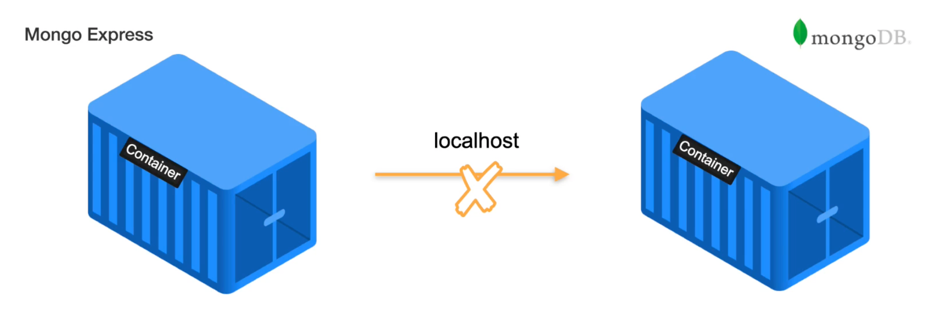
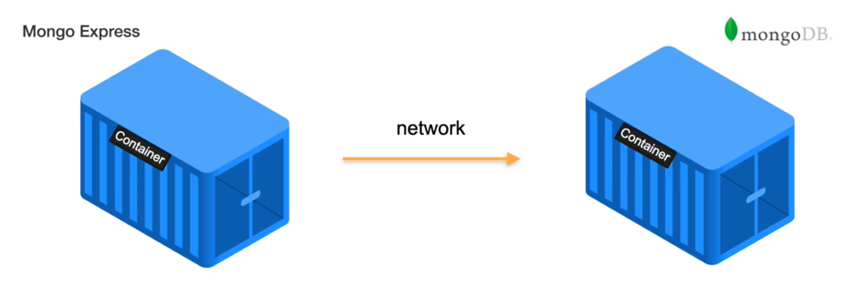

# 1. Getting Started

## 1.1. What Is Docker


- Platform for building, running and shipping applications.
- Developers can easily build and deploy applications running in **containers**.
- Container is like a running instance of our application, packaged up and running within a container.
- Local development is the same across any environment.
  - There are scenarios where the application may work on your local machine, but doesn't work on development, staging or production environment, because of hardware issues, installation problems etc.
  - Docker abstracts and solves all of those problems so that it always works on every environment and every machine.
- Docker is also used a lot for CI/CD (Continuous Integration/Continuous Delivery) workflows.

## 1.2. Docker vs VM

### 1.2.1. Virtual Machine (VM)

- **Virtual Machines (VMs)** are an abstraction of physical hardware turning one **server** into **many servers**.
- The **hypervisor** allows multiple VMs to run on a single machine.
- Each VM includes a **full copy** of an operating system, the application, necessary binaries and libraries – taking up tens of GBs.
- VMs can also be slow to boot, whereas with Docker containers are very fast to boot.


- Each VM consists of:
  - Infrastructure
  - Hypervisor
  - VM (application) running on a Linux OS (this can have multiple copies, each one running the application).

### 1.2.2. Docker

- Docker runs your applications in something called **containers**.
- **Containers** are an abstraction at the app layer that packages code and dependencies together.
- Multiple containers can run on the same machine and share the OS kernel with other containers, each running as isolated processes in user space.
- Containers take up less space than VMs (container images are typically tens of MBs in size), can handle more applications and require fewer VMs and operating systems.


- Each container consists of:
  - Infrastructure
  - Host operating system
  - Docker
  - Application (which can have multiple copies).

### 1.2.3. Docker vs VM


- The key difference is the host operating system.
- VM has 3 copies while Docker only has 1.
- Therefore, we gain more performance using Docker.

### 1.2.4. The Difference

| Docker                           | VM                         |
|----------------------------------|----------------------------|
| Portable                         | Requires more memory       |
| Requires less memory             | Each VM runs on its own OS |
| All containers share the same OS | Startup time in minutes    |
| Startup time in milliseconds     | More secure                |
| Process level isolation          | Less popular these days    |
| Very popular                     |                            |

## 1.3. Installing Docker

- Install docker on https://docker.com/ and follow installation instructions.

## 1.4. Exploring Docker Dashboard

- **Containers / Apps tab:**
  - This is where the applications we built will be running.
  - Initially there shouldn't be anything listed.
- **Images tab:**
  - These are the images either on your local machine or remote repositories (Docker registries).
- **Volumes tab:**
  - This is used, so you can share data between host and containers.
- **Dev Environments:**
  - Define your project's configuration as code, distribute your project easily amongst your team, and have everyone work on the same code and any dependencies with one click.

## 1.5. Tools

Useful tools and resources to know and install that will be helpful in using Docker:
- Knowledge of: terminal, bash & Vim
- https://gitforwindows.org/ (Windows)
- https://cmder.app/
- https://iterm2.com/ (Mac)

## 1.6. Getting Started With Docker

1. Verify that Docker is installed:
```bash
docker --version
```
- This command should output the installed Docker version.
2. View all available Docker commands:
```bash
docker
```
3. Create a Hello World Docker application:
```bash
docker run -d -p 80:80 docker/getting-started
```
4. Navigate to the browser and check if Docker is now running on localhost:
```bash
http://localhost
```
5. List all running Docker processes:
```bash
docker ps
```
- There should be a `docker/getting-started` image process running.
6. Stop the container from running by targeting container ID:
```bash
docker stop 9919e467353a
```
7. Remove the entire docker container:
```bash
docker rm 9919e467353a
```
8. Pull and run a specific Docker image:
```bash
docker run -d -p 80:80 milanobrenovic/2048
```
9. Now test if a 2048 game is running on localhost:
```bash
http://localhost
```

# 2. Containers

## 2.1. Understanding Containers

### 2.1.1. Containers


- Container is an **isolated** environment for running applications.


- Contains everything your application needs, such as:
  - Operating system
  - Tools and binaries
  - And most importantly, software (spring boot, nodejs, golang, javascript, or whatever is the backend application built on)


- When you run the command `docker run` following the image name, that gave us the application deployed on Docker.

1. The command `docker ps` gives us a list of all running containers:
```bash
docker ps
```
- There should be 0 containers running.
2. Assuming there are no running containers, let's run the `milanobrenovic/2048` image:
```bash
docker run -d -p 80:80 milanobrenovic/2048
```
3. Now when you list all the Docker processes running:
```bash
docker ps
```
- There should be 1 running.
- Basically the process running here is a **container**.
4. Execute into the running container via interactive mode using container ID:
```bash
docker exec -it 4edc54e943c5 sh
```
5. Within the shell, list all the files and folders:
```bash
ls
```
6. Navigate to `nginx` directory:
```bash
cd /usr/share/nginx/html
```
7. By using `ls` in this directory, you can see all the files and folders uploaded via Docker which is then being run on http://localhost.

## 2.2. Docker Images And Containers


- Usually when building software, you have your source code, which is any code written in any programming language.
- What you (as a developer) do, is you take that code, and then you build a Docker image.
- From this Docker image, you can run a container.
- Docker image is like a template for running the application.


- From 1 Docker image, you can run multiple containers.
- A Docker container can be a javascript app, nginx, postgres or any technology that you want to use.
- In the previous examples, `milanobrenovic/2048` is the **image name**.
- From this image name, we can run a container.

1. To run a different image but on a port `8080`, use command:
```bash
docker run -d -p 8080:80 nginx
```
- Here we have started an image `nginx` which runs a container serving us the nginx starter template.
2. List all Docker processes running:
```bash
docker ps
```
3. Check in the browser and verify that this container is running:
```bash
http://localhost:8080
```
4. To browse through all public Docker images, go to https://hub.docker.com/search?q=.
5. Let's try to install a WordPress Docker image:
```bash
docker run -d -p 8081:80 wordpress
```
- **Note:** this will be run on port `8081` because `80` and `8080` are already taken and running.
6. Check on localhost if WordPress Docker container is running:
```bash
http://localhost:8081
```

## 2.3. Managing Containers

1. List all running Docker containers:
```bash
docker ps
```
- By now it should be 3 containers: 2048, nginx and wordpress.
2. Stop the `wordpress` container by container ID:
```bash
docker stop 3635573b4e19
```
3. List ALL containers (including the ones that are not running):
```bash
docker ps -a
```
4. Remove the `wordpress` container completely by container ID:
```bash
docker rm 3635573b4e19
```
- In case the container is running, you would need to stop it first and then remove.
5. To remove a running container without stopping it first, use command:
```bash
docker rm -f 3635573b4e19
```

## 2.4. Docker Ps Format

1. To have a different format output than the one printed after using `docker ps` command, export this variable in the system environment variables:
```bash
export DOCKER_ROW_FORMAT="ID:\t\t{{.ID}}\nNAME:\t\t{{.Names}}\nIMAGE:\t\t{{.Image}}\nPORTS:\t\t{{.Ports}}\nCOMMAND:\t{{.Command}}\nCREATED:\t{{.CreatedAt}}\nSTATUS:\t\t{{.Status}}\n"
```
2. To apply this new format, use command:
```bash
docker ps --format=$DOCKER_ROW_FORMAT
```

## 2.5. Exposing Ports


- Currently, we have a container which is running a 2048 game, which is based off nginx image, and it's listening on port 80.
- Sometimes we may want to expose the application to users.
- It could be a React application, just a web browser, pretty much any client.
- The client, in order to access the application, needs to talk to the container.
- Container then exposes port 80, because nginx is listening on port 80.
- This allows to issue a request from the client as `http(s)://ip-address:80`.
- The command `-p 80:80` sets the port:
  - The first port `80` refers to the **host**.
  - The second port `80` is the **container**.

## 2.6. Exposing Multiple Ports

1. List all running Docker containers:
```bash
docker ps
```
2. Remove the `milanobrenovic/2048` container:
```bash
docker rm -f beautiful_swirles
```
- **Note:** you can target a container by its randomly generated name instead of container ID.
3. Run a container and expose multiple ports on the host:
```bash
docker run -p 80:80 -p 4200:80 -p 3000:80 -d milanobrenovic/2048
```
4. Now test all localhost + port addresses and verify that it works:
```bash
http://localhost
http://localhost:4200
http://localhost:3000
```
- All of these urls should open the same container.

## 2.7. Naming Containers

1. List all running Docker containers:
```bash
docker ps
```
2. Remove the `milanobrenovic/2048` container:
```bash
docker rm -f 0bdd84f3b8f5
```
3. Run `milanobrenovic/2048` again but this time give the container a name:
```bash
docker run --name 2048 -d -p 80:80 milanobrenovic/2048
```
4. List all running Docker containers and verify that the name was changed:
```bash
docker ps
```
5. This means we can remove the container by the given name instead of the randomly generated one or the container ID:
```bash
docker rm -f 2048
```
6. Remove the `nginx` container:
```bash
docker rm -f 9c9b8100a7e6
```
7. Recreate `nginx` container but with its own name:
```bash
docker run --name website -d -p 8080:80 nginx
```

## 2.8. Running Container In The Background

1. List all the containers:
```bash
docker ps
```
2. Remove the `website` container:
```bash
docker rm -f website
```
3. Running the container without `-d` will print the logs on the terminal screen:
```bash
docker run --name website -p 8080:80 nginx
```
- This will still work, but the terminal window can't be used because the container is running in the foreground and not in background.
4. That is why the container should be ran `-d` most of the time, which will run it in background mode:
```bash
docker run --name website -d -p 8080:80 nginx
```

# 3. Images

## 3.1. Docker Images

- A Docker image is a file used to execute code in a Docker container.
- Set of instructions to build a Docker container.
- From a single Docker image, we can run multiple containers.
- Contains:
  - Application code
  - Libraries
  - Tools
  - Everything needed to run your application
- Docker image is like a blueprint from which we can run multiple instances (containers) of the application we're building.

## 3.2. Managing Docker Images

1. List all docker images:
```bash
docker image ls
```
2. If the `website` container exists, delete it:
```bash
docker rm -f website
```
3. Run the website container again:
```bash
docker run --name website -d -p 8080:80 nginx
```
- Here we can notice how quickly it pulled the container, because the image was already installed in the local machine, so it just uses the existing image.
4. To delete the image:
```bash
docker image rm nginx
```
In case there's a conflict and the image can't be removed, it's probably because the container is already running, so delete the container:
```bash
docker rm -f website
```
Now remove the image again:
```bash
docker image rm nginx
```
5. Run the website container again:
```bash
docker run --name website -d -p 8080:80 nginx
```
- This time it should take longer to start the container because the image doesn't exist locally, so it has to pull it from Docker repository.

## 3.3. Docker Pull

1. Remove the `website` and `nginx` containers:
```bash
docker rm -f website
docker rm -f nginx
```
2. The `docker run ...` command pulls the image first and then runs the container, but if you want to just pull the image without running it, use command:
```bash
docker pull nginx
```

## 3.4. Inspecting Images

1. Inspect a specific image:
```bash
docker image inspect nginx
```

# 4. Docker Architecture

## 4.1. Docker Architecture


- Docker architecture follows the client-server approach.
- **The client** is the CLI that we've been using.
- **The server** is the Docker Host.
- There are also Registries (place from which we use the public/private images).
- Inside the Docker host, there is something called a Docker Daemon.
- **Docker Daemon** is responsible for handling the requests from the client, such as:
  - `docker build`
  - `docker run`
  - `docker pull`
- Let's say we want to run a container, if the container is not present on the local host, the Docker daemon goes and fetches it from the registry and stores it on the host.
- Once it fetches the image, we can run containers from the image.
  - For example one container for spring boot, the other container for postgres database etc.

## 4.2. Docker Daemon


- When the client issues commands to the Docker daemon, this communication is transferred via the Docker Sock.
- Docker Sock is basically a unique socket.
- The Docker client communicates usually with the daemon via the unix socket `/var/run/docker.sock`.
- A UNIX socket, is an inter-process communication mechanism that allows bidirectional data exchange between processes running on the same machine.

# 5. Volumes

## 5.1. Volumes

### 5.1.1. Docker Volumes


- Allows data to be shared between **containers** and **host**.
- Data can be kept after container dies.
- Let's say we have 2 containers, and we want to share data between them – this should be done through **volumes**.


- The types of files to share through volumes would typically be:
  - Certificates
  - Config files
  - Folders
  - Anything you want

1. Run bash image from Docker, insert text into the file and print it:
```bash
docker run bash bash -c "echo foo > bar.txt && cat bar.txt"
```
- Here we have pulled the `bash` from Docker repository.
- Then using the `-c` (command), an echo of text "foo" was inserted into `bar.txt`, and using `cat bar.txt` it read the contents of that .txt file, printing out just "foo".
2. Run the exact same image but without echoing any text into the file:
```bash
docker run bash bash -c "cat bar.txt"
```
- It should return an error because it can't find the `bar.txt` file.
3. List all containers INCLUDING the ones that are not running:
```bash
docker ps -a
```
- There should be bash containers with status `Exited`.
- When we try to just read the contents of `bar.txt` it can't because each container is separate and shut down.
- This is one of the reasons why we need to use volumes.

## 5.2. Bind Mount Volumes

### 5.2.1. Different Types Of Volumes


- First we have a host.
  - Host is your operating system that is running Docker.
- Inside the host, let's say that we have:
  - Container
  - Filesystem
  - Memory (RAM)
- When it comes to **volumes**, we can have something called a **bind mount**.
  - This allows the host to share its own file system using the command `-v host-path:container-path`.

## 5.3. Bind Mount Volumes In Action

1. To get a help of all `docker run` commands:
```bash
docker run --help
```
- There should be a `-v` command to bind mount a volume.
2. To bind mount a volume, we'll use [bind-mount](bind-mount) directory:
```bash
docker run -v $PWD/bind-mount:/tmp bash bash -c "echo foo > /tmp/bar.txt && cat /tmp/bar.txt"
```
- In case the mount is denied, in Docker Desktop software go to:
  1. Settings
  2. Resources
  3. File sharing
  4. Add a resource file path to [bind-mount](bind-mount) directory
- Otherwise, Docker should create a `bar.txt` file with contents of `foo`.
3. Let's try to read the contents of that same file:
```bash
docker run -v $PWD/bind-mount:/tmp bash bash -c "cat /tmp/bar.txt"
```
- This should now print the contents successfully.

## 5.4. Using Volumes For Local Development

1. Let's pick some free admin template such as https://startbootstrap.com/themes.
2. Run the `nginx` container and name it `dashboard`:
```bash
docker run --name dashboard -d -p 8080:80 nginx
```
3. Verify on localhost that it works:
```bash
http://localhost:8080
```
4. Delete this container:
```bash
docker rm -f dashboard
```
5. Run a container but using the [dashboard](dashboard) directory which contains an admin dashboard template:
```bash
docker run --name dashboard -v $PWD/dashboard:/usr/share/nginx/html -d -p 8080:80 nginx
```
6. Verify on localhost this admin dashboard template is running:
```bash
http://localhost:8080
```
- Make some changes inside the [index.html](dashboard/index.html) file at line 38 by changing the title to something else.
- These changes should take effect immediately on the browser now because we have mounted a volume.
- Whatever changes that we make will be reflected on the host, and vice versa.

## 5.5. Docker Volumes


- Inside the Filesystem, there is an area which is used specifically for Docker.
- What we can do is from our container, we can create a volume directly into this area.
  - The key thing here is that this Filesystem is managed by Docker itself, so we have no control over it.

1. Create a volume and name it `vol1`:
```bash
docker volume create vol1
```
2. Inspect this newly created volume:
```bash
docker volume inspect vol1
```
3. List all volumes:
```bash
docker volume ls
```
- There should be `vol1` we created just now.
4. To remove a specific volume:
```bash
docker volume rm vol1
```

## 5.6. TMPFS Mount


- There are 3 different types of volumes:
  - **Bind mount**
    - This is when you take a portion of your file system, and you share it between the containers.
  - **Docker Volume**
    - This is using a portion on the file system which is specifically for the Docker itself.
  - **TMPFS mount**
    - TMPFS mount is used when you want to mount to the RAM, basically a temporary storage.

# 6. Building Docker Images

## 6.1. Dockerfile

### 6.1.1. Build Docker Images


- By now, we've seen how from code we can create a Docker image, which then runs containers.
- The images used by now were images that someone built for us to use, such as `nginx`, `milanobrenovic/2048`, etc.
- To create a Docker image from our code, we need a **Dockerfile**.
- **Dockerfile** is a set of commands used to assemble a Docker image.

## 6.2. Creating Dockerfile

1. List all containers including those which are not running:
```bash
docker ps -a
```
- There should be a container with `NAMES` column labeled as `dashboard`, if not run the command:
```bash
docker run --name dashboard -v $PWD/dashboard:/usr/share/nginx/html -d -p 8080:80 nginx
```
- If the container is not running, run it:
```bash
docker start dashboard
```
- Instead of mounting to the volume, what we want to do is create a Docker image that will contain everything regarding `dashboard` template, so we don't have to mount anything.
2. To solve this, create a [Dockerfile](dashboard/Dockerfile) along with instructions to build that Docker image.

## 6.3. Building Docker Images

1. List all images:
```bash
docker image ls
```
2. Build a Docker image using the Dockerfile:
```bash
docker build dashboard/. -t dashboard
```
- `-t` is a tag and allows us to just give a name to this image that's being created.
3. To confirm that this has worked, run this command:
```bash
docker image ls
```
- Under `REPOSITORY` column there should be an image called `dashboard`.

## 6.4. Running A Container From Custom Image

1. First remove the existing `dashboard` container if it exists:
```bash
docker rm -f dashboard
```
2. List all images:
```bash
docker images
```
- We no longer want to take the `nginx` image, we want to take `dashboard` image this time.
3. Run the container but from `dashboard` image we just built:
```bash
docker run --name dashboard -d -p 8080:80 dashboard
```
4. List all containers:
```bash
docker ps
```
5. Navigate to localhost and verify that the admin dashboard template is still working:
```bash
http://localhost:8080
```
- **Note:** this is being run from `dashboard` image.
- This way we don't have to mount any volume.

## 6.5. Investigate Container File System

1. Execute into the `dashboard` container via interactive mode:
```bash
docker exec -it dashboard sh
```
2. Navigate to the nginx html directory:
```bash
cd /usr/share/nginx/html
```
This is where the entire `dashboard` image is uploaded, list everything:
```bash
ls
```

## 6.6. Building ExpressJS API

1. Generate a starter ExpressJS app, full documentation at: https://expressjs.com/en/starter/installing.html.
2. Create a [server.js](user-api/server.js) ExpressJS starter file with 2 example routes.
3. One option is to install express locally, but since we have Docker we don't have to, just run the command:
```bash
docker run -w /src -v $PWD/user-api:/src --rm node npm init --yes
```
- `-w /src`
  - This will create a folder inside the container called `src`.
- `-v $PWD/user-api:/src`
  - Mounts a volume called `$PWD/user-api` into the folder we just created called `/src`.
- `--rm`
  - Removes the container when it exists (so we don't have to manually do `docker rm ...`).
- `node npm init --yes`
  - Node is the image name from Docker registry.
  - Then we install the required npm packages and approve everything necessary to be installed with `--yes` command.
- There should be [package.json](user-api/package.json) file generated now.
4. Now let's install Express:
```bash
docker run -w /src -v $PWD/user-api:/src --rm node npm i -S express
```

## 6.7. Dockerfile And Building Image For `user-api`

1. Add a [Dockerfile](user-api/Dockerfile) with instructions to build an image of this ExpressJS backend app.
2. Build this image from the Dockerfile:
```bash
docker build user-api/. -t user-api
```
3. List all images and confirm that `user-api` is showing:
```bash
docker images
```

## 6.8. Running Container For `user-api` Image

1. Run the image we just built:
```bash
docker run --name user-api -d -p 3000:3000 user-api
```
2. List all containers and verify that `user-api` is running now:
```bash
docker ps
```
3. Navigate to the localhost and verify that the backend API routes work:
```bash
# Outputs `Hello World!`
http://localhost:3000

# Outputs a JSON array of user objects
http://localhost:3000/api/v1/users
```

## 6.9. Exploring Dockerfiles

- On Docker Hub we can search for all the built Docker images: https://hub.docker.com/search?q=.
- For example, postgres:
  - https://hub.docker.com/_/postgres
  - Scrolling down below there's a version `15`.
  - It should open a `Dockerfile` which has Docker commands, running shell scripts and all of it begins with `FROM` command.
- **Pro-tip:** to learn how to write Dockerfiles, it is highly advisable to look at how other people write Dockerfiles.

## 6.10. Dockerfile Reference

- Official documentation reference regarding Dockerfile: https://docs.docker.com/engine/reference/builder/

# 7. Image Tagging And Versioning

## 7.1. Pulling Images Using A Specific Tag

1. Pull the `postgres` image:
```bash
docker pull postgres
```
- Notice how it's using the **default tag: latest**.
- This means that it's downloading the **latest** version of `postgres` image.
2. List all images:
```bash
docker images
```
- There should be a `postgres` image.
3. Pull a specific image version by targeting a tag:
```bash
docker pull postgres:14beta2
```
4. List all images again and verify the tag version is now `14beta2`:
```bash
docker images
```

## 7.2. Creating Tags

1. Create a new tag for `dashboard` image based off the `latest` tag:
```bash
docker tag dashboard:latest dashboard:v1
```
- This should now create a `v1` version of our `dashboard` image.
2. List all images and confirm if there is a `dashboard` image with `v1` tag:
```bash
docker images
```
3. Remove a specific image with the specific tag:
```bash
docker rmi dashboard:v1
```
Also delete the whole dashboard image:
```bash
docker rm -f dashboard
```
4. Build a `dashboard` image but with 2 different tags:
```bash
docker build -t dashboard:latest -t dashboard:v1 dashboard/.
```
5. List all images and confirm if there is a `dashboard` image with `v1` tag:
```bash
docker images
```
6. Run the `v1` container:
```bash
docker run --name dashboard-v1 -d -p 8080:80 dashboard:v1
```
Now run the `latest` container but under port `8081`:
```bash
docker run --name dashboard-latest -d -p 8081:80 dashboard:latest
```
7. Verify on localhost that both instances are the exact same thing in this case:
```bash
http://localhost:8080
http://localhost:8081
```

## 7.3. Creating Version 2 Of The Dashboard

1. Update [index.html](dashboard/index.html) at some parts just to make it distinct that it's a version 2.
2. Build this `v2` image:
```bash
docker build -t dashboard:latest -t dashboard:v2 dashboard/.
```
3. List all images and verify `v2` image exists:
```bash
docker images
```
4. Remove the `dashboard-latest` container:
```bash
docker rm -f dashboard-latest
```
5. Run the `dashboard-latest` again:
```bash
docker run --name dashboard-latest -d -p 8081:80 dashboard
```
6. Check if the `dashboard-latest` changes have been reflected on localhost:
```bash
http://localhost:8081
```
7. Now run the `v2` on port `8082`:
```bash
docker run --name dashboard-v2 -d -p 8082:80 dashboard:v2
```
8. Check if the `dashboard-v2` changes have been reflected on localhost:
```bash
http://localhost:8082
```
- It should be the same as `v1` since nothing was changed.

## 7.4. Never Run Latest In Production

- **Never** run the `latest` version of custom images in production.
- This is because if your latest software has changes, for example let's say that you're running Kubernetes, or a VM and the VM restarts, it would pull the image and always pull the latest image.
- Therefore, leaving you without control with the image that you're running in production.
- Always stick to using a **tag**.

## 7.5. Image Variants

- Take a look at for example [Node Image](https://hub.docker.com/_/node).
- There are several supported tags (versions of Node).
- More information regarding differences between these versions can be found on this [Medium Article](https://medium.com/swlh/alpine-slim-stretch-buster-jessie-bullseye-bookworm-what-are-the-differences-in-docker-62171ed4531d).
- Some versions are:
  - **stretch/buster/jessie**
    - Written for different Debian releases.
  - **-slim**
    - Paired down version of the full image.
    - Only installs minimal packages needed to run your particular tool.
    - Leaves out lesser-used tools and binaries that you don't need.
  - **-alpine**
    - Based on the Alpine Linux Project.
    - Operating system that was built for use inside of containers.
    - Has a really tiny size.
    - However, some teams are moving away from alpine because these images can cause compatibility issues that are hard to debug.

# 8. Docker Registries

## 8.1. Docker Registries

- **Docker registry** is a storage and distribution system for Docker images, such as **Dockerhub**.
- There can be 2 types of images:
  - **Public**
    - Publicly available, anyone can pull those images.
  - **Private**
    - Images that you have full control, and only you can pull those images.
- The command `docker pull` fetches a Docker image from Docker registry to our local machine (the host).
- Any image stored on the local machine can be pushed back to the Docker registry using the command `docker push`.
- Most popular Docker registries are:
  - [DockerHub](https://hub.docker.com/search?q=)
  - [Amazon Elastic Container Registry](https://aws.amazon.com/ecr/)
  - [Google Container Registry](https://cloud.google.com/container-registry)
  - [Microsoft Azure Container Registry](https://azure.microsoft.com/en-us/products/container-registry)
  - [GitHub Packages](https://github.com/features/packages)

## 8.2. Docker Login

1. Sign into Docker Hub: https://login.docker.com/u/login
2. Try to pull one of the public images:
```bash
docker pull milanobrenovic/kubernetes:frontend-v1
```
- This is a public image and anyone can pull it without authenticating.
3. Now try to pull a private image:
```bash
docker pull milanobrenovic/private-frontend
```
- This should fail if you're not authenticated into the `milanobrenovic` Docker Hub account.
4. To authenticate, use command:
```bash
docker login -u 'milanobrenovic' -p '<password>'
```
**Note:** you can view all the login commands with:
```bash
docker login --help
```
5. View the Docker login configuration:
```bash
cat ~/.docker/config.json
```
- There should be a json key with `credsStore`.
```json
{
  "credsStore": "desktop"
}
```
- `desktop` means you will be prompted to enter username/password manually when you want to push a repository to Docker Hub.
- `osxkeychain` is only for Mac and means it will automatically use the username/password saved in Key Chain Access software, without you having to manually login.

## 8.3. Docker Push

1. List all images:
```bash
docker images
```
- Make sure there is a `user-api` repository available locally.
2. Since it exists on the local machine only, we have to re-tag it to the Docker Hub repository `milanobrenovic/user-api`:
```bash
docker tag user-api:latest milanobrenovic/user-api:latest
```
3. List all images again:
```bash
docker images
```
- Verify that there is an image from repository `milanobrenovic/user-api` this time.
4. Push this local image to Docker Hub:
```bash
docker push milanobrenovic/user-api:latest
```

# 9. Debugging

## 9.1. Docker Inspect

1. Get more information about a specific container:
```bash
docker inspect dashboard-v1
```

## 9.2. Logs

1. View logs for a specific container:
```bash
docker logs dashboard-v1
```
2. View logs in real-time to watch changes as they happen:
```bash
docker logs dashboard-v1 -f
```

## 9.3. Running Commands In Containers

1. Execute into the container `user-api` and list all its environment variables:
```bash
docker exec user-api env
```
2. List all the files in the working directory:
```bash
docker exec user-api ls
```
3. Get working directory:
```bash
docker exec user-api pwd
```
4. Get root directory:
```bash
docker exec user-api ls /
```
5. Execute into `user-api` container shell via interactive mode:
```bash
docker exec -it user-api sh
```
6. From inside the running container, you can use all the Linux commands such as:
- `pwd` working directory.
- `ls` list all files and folders.
- `cd /` change directory to root.
- `top` see all top processes running within this container.
- `df` check disk space usage.
- ...
7. If the container doesn't support `sh`, you can also `bash` into it:
```bash
docker exec -it user-api bash
```

# 10. Networking

## 10.1. How To Communicate Between Containers

### 10.1.1. Docker Network



- Let's say that we have a **Mongo Express** container and a **MongoDB** container.
- Mongo Express is a GUI client that allows to connect to the Mongo database, so you can see all the collections, documents, perform queries etc.
- To connect these two containers together, using localhost will **NOT** work.
- That is because each container is self-contained for itself, and it only knows about the services running inside of that container.



- To have these two containers talk to each other, we have to use **Docker Network**.
- A network needs to be created and attached to these two containers.
- When containers want to talk to each other, they just refer to the container name itself.

## 10.2. Docker Network

1. To allow containers to talk to each other, create a network called `mongo`:
```bash
docker network create mongo
```
2. List all networks:
```bash
docker network ls
```
- Confirm that there is a `mongo` network listed.
3. To remove a network, use command:
```bash
docker network rm mongo
```
4. Inspect a specific network:
```bash
docker network inspect mongo
```
- The default network driver should be `bridge`.
- Full documentation to learn about all the network drivers can be found at: https://docs.docker.com/network/

## 10.3. MongoDB Container

- Full documentation for Docker `mongo` image:
  - https://hub.docker.com/_/mongo

1. List all networks:
```bash
docker network ls
```
- Confirm that there is a `mongo` network listed.
2. Run this newly created network:
```bash
docker run --name mongo -d -p 27017:27017 --network mongo -e MONGO_INITDB_ROOT_USERNAME=username -e MONGO_INITDB_ROOT_PASSWORD=secret mongo:5.0.15
```
- `--name mongo` give this container a name of "**mongo**".
- `-d` run this container in **detach** mode (background mode).
- `-p 27017:27017` run the MongoDB on port **27017**.
- `--network mongo` switch to **mongo** network.
- `-e MONGO_INITDB_ROOT_USERNAME=username` set the database username to "**username**" to keep it simple.
- `-e MONGO_INITDB_ROOT_PASSWORD=secret` set the database password to "**secret**".
- `mongo:5.0.15` use the "**mongo**" Docker image to create this container and target the **5.0.15** version of that image.
3. View logs of the `mongo` container:
```bash
docker logs mongo
```
- Notice at the bottom how it's "Waiting for connections", listening on "localhost" and port "27017".
